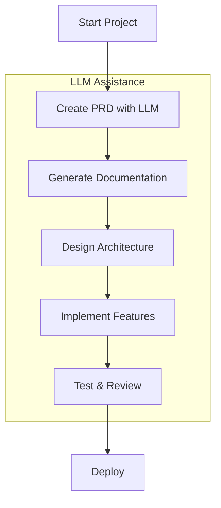
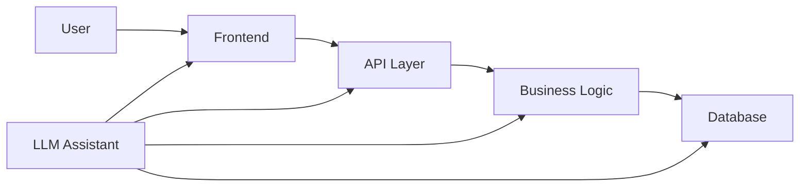

<!-- project-docs/app_flow.md -->

# Application Flow and Architecture

## LLM-Assisted Development Workflow



## Application Architecture

### High-Level Flow
1. **User Interaction**
   - User submits request
   - System processes input
   - LLM assists in response generation
   - System returns result

2. **LLM Integration Points**
   - Code generation
   - Documentation
   - Testing
   - Review process

### Component Interaction



## Development Process

### 1. Requirements Gathering
- LLM assists in PRD creation
- Generate user stories
- Define acceptance criteria
- Plan implementation

### 2. Design Phase
- Architecture design with LLM
- Database schema design
- API specification
- UI/UX planning

### 3. Implementation
- Code generation with LLM
- Test generation
- Documentation
- Review process

### 4. Testing & Deployment
- Automated testing
- Performance optimization
- Security review
- Deployment automation

## LLM Integration Points

### Code Generation
1. **Boilerplate Code**
   - Project structure
   - Basic components
   - Configuration files

2. **Feature Implementation**
   - Core functionality
   - Business logic
   - API endpoints

3. **Testing**
   - Unit tests
   - Integration tests
   - Performance tests

### Documentation
1. **Technical Documentation**
   - API documentation
   - Code comments
   - Architecture diagrams

2. **User Documentation**
   - User guides
   - API references
   - Deployment guides

## Best Practices

### LLM-Assisted Development
1. **Clear Communication**
   - Use specific prompts
   - Provide context
   - Review outputs

2. **Code Quality**
   - Follow standards
   - Write tests
   - Document thoroughly

3. **Review Process**
   - Code review
   - Security review
   - Performance review

### Architecture Guidelines
1. **Modularity**
   - Clear separation of concerns
   - Reusable components
   - Maintainable structure

2. **Scalability**
   - Horizontal scaling
   - Load balancing
   - Caching strategy

3. **Security**
   - Authentication
   - Authorization
   - Data protection

---

## 1. High‑Level User Journey

1. **Signup / Login**  
   - User visits `/auth/signup` or `/auth/login`  
   - User submits credentials  
   - JWT issued & stored in client

2. **Dashboard**  
   - GET `/projects` → List projects  
   - “Create New Project” button → opens project creation modal

3. **Project Workspace**  
   - Sidebar: docs, code snippets, tests  
   - Main pane: AI chat interface + code preview  
   - Top bar: “Generate Feature” dropdown

4. **Feature Generation**  
   - Developer selects “Auth Module” → AI ingests PRD & rules  
   - Agent returns code + suggested tests  
   - Inline diff view for review & commit

5. **Review & Merge**  
   - Developer clicks “Approve & Commit”  
   - POST `/projects/{id}/snippets` → saves snippet  
   - Trigger CI pipeline

---

## 2. Endpoint Wireframes

```mermaid
flowchart LR
  A[Login Page] --> B[Dashboard]
  B --> C[Project Workspace]
  C --> D[AI Chat]
  C --> E[Docs Browser]
  C --> F[Code Preview]
  C --> G[Commit History]
